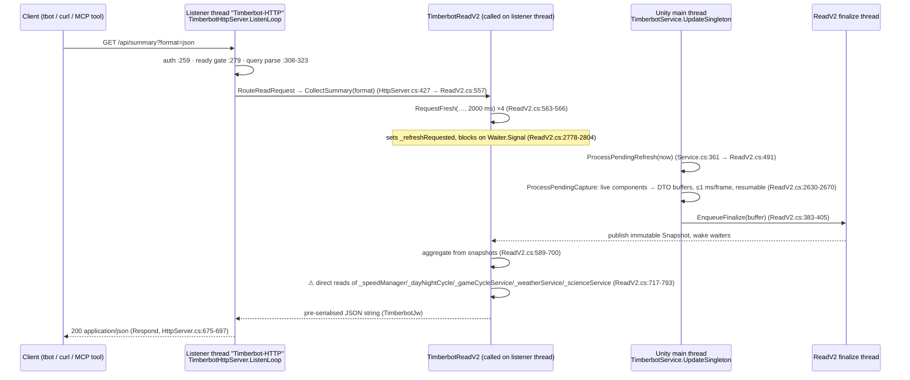
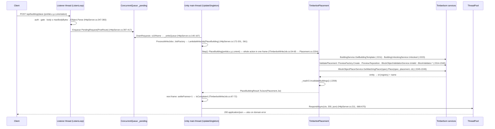

# Phase 0 — Repository audit: Timberbot → Timberborn MCP agent platform

| | |
|---|---|
| Audited commit | `d21988a` (`netzkontrast/timberbot` `main` = `impuls42/timberbot` `main`, 2026-05-26) |
| Audit date | 2026-09-02 |
| Method | Read-only. No builds, no game, no code edits. Every identifier carries `path:line` + confidence (HIGH = read in code, MEDIUM = code + docs inference, LOW/UNVERIFIED = needs the game or its DLLs). |
| Companion files | `contradictions.md` (C1–C21), `appendix-a-endpoint-inventory.md`, `appendix-b-symbol-inventory.md`, `appendix-c-python-layer.md` |
| Environment caveat | No Timberborn install, no game DLLs, no `dotnet` in the audit container (`dotnet: command not found`; no `~/.steam`). Token counts use `tiktoken` `o200k_base`; `/api/tiles` and the ASCII map were measured on a **synthetic** 21×21 … 128×128 region because the committed `tiles.json` fixture is the map-size probe only (63 bytes). Live-game numbers are a Phase 1 task. |

## 0. Executive summary

1. **The starting point is not v0.7.1 abix- but v0.8.0 impuls42.** This repo mirrors `impuls42/timberbot` byte-for-byte (same HEAD sha); it already has a WebSocket event channel, a FastMCP server with 70 tools, an ACP-based agent connector, a Telegram front end and a 500-case test suite. The kickoff premise "no Timberborn MCP server exists" is refuted (`python/src/timberbot/game_mcp/server.py:102-112`, HIGH). See `contradictions.md` C1–C2.
2. **The write path is clean by construction; the read path leaks.** All 35 POST routes go through one `ConcurrentQueue` → `IUpdatableSingleton.UpdateSingleton()` → single active `ITimberbotWriteJob` (`TimberbotHttpServer.cs:140-224`, `TimberbotService.cs:357-365`, HIGH). But three GET endpoints (`summary`, `tiles`, `prefabs`) call live, non-thread-safe game services on the HTTP listener thread, contradicting the mod's own rule (`TimberbotReadV2.cs:50-56`; §2.4, §8 H1).
3. **The observation surface is the bottleneck, as predicted by the FLE lesson.** `/api/tiles` costs ≈57 tokens per cell (21×21 ≈ 25k tokens); the client-side ASCII map costs ≈0.6–0.85 tokens/cell but ships ANSI escapes that inflate it ≈7× when it lands in a shell tool's output; the MCP server exposes **no** spatial tool at all. There is no layered read, no delta read, and elevation/water are encoded once as scalars per cell (§6).
4. **Errors are legible to humans, not to machines.** Domain failures return HTTP 200 with `{"error": "code: message …"}`; placement failures embed why + hint in one free-text string without a code; only the 409 ready-gate body has a `hint` field (`TimberbotJw.cs:149-156`, `TimberbotPlacement.cs:2323-2380`, `TimberbotAgentState.cs:369-370`; §3.3).
5. **Drift exposure is concentrated and enumerable.** 90 Timberborn namespaces, ≈168 types, ≈330 members; 8 publicized-private members and 17 reflection string literals carry almost all the risk; no Harmony, BepInEx is build-time only (Appendix B §3–§5). No drift detector, no CI build of the mod (CI compiles only four Unity-free files, `.github/workflows/dotnet-tests.yml:29-31`).

**Single most surprising finding:** the repo already contains most of the "greenfield" layers 2 and 3 — just against the wrong MCP revision (SSE, stateful, no annotations/MRTR) and with an agent loop that injects one observation into a system prompt and never observes again (`python/src/timberbot/agent/runner.py:106-198`).

## 1. Repo map

### 1.1 Provenance and git state (HIGH)

| Fact | Value | Anchor |
|---|---|---|
| `origin` | `https://github.com/netzkontrast/timberbot` (fetch+push); no `upstream` remote configured | `git remote -v` |
| Lineage | `abix-/TimberbornMods` (master `7b8d5de`, manifest still `0.7.1`, tags v0.2.0…v0.3.8) → `impuls42/timberbot` (main `d21988a`, 856 commits per GitHub, branches `feat/acp-connector`, `feat/cli-verbose-debug`, `feat/tbot-serve-cli`, `feat/user-api-telegram`, `fix/connector-cleanup`, `fix/get-running-loop`, `gh-pages`) → this repo (main `d21988a`) | `git ls-remote`; `README.md:7`; `mkdocs.yml:3-5` |
| Local history | 50 commits, root `df5cc98` (2026-05-16, "Unit 3: Add tbot watch…") has **no parent** — history was re-rooted, so there is no common ancestor with either upstream | `git log --format='%H %P'` (last entry) |
| Tags | none | `git tag` |
| Open PRs / issues on this repo | 0 / 0 | GitHub API via MCP |
| Open issues upstream | abix-: 0; impuls42: 0 (GitHub page) | WebFetch 2026-09-02 |
| Mod version | `0.8.0` | `timberbot/src/manifest.json:3`, `timberbot/src/Timberbot.csproj:6` |
| Python package version | `0.9.0` (`timberbot` on PyPI, `tbot` CLI) | `python/pyproject.toml:7,58` |
| Licence | GPL-3.0 (`LICENSE`); Python package metadata says MIT | `python/pyproject.toml:10` — flag for Phase 1 (not a relicensing discussion, a metadata inconsistency) |

Consequence for rule §3.6 ("keep the upstream merge path open"): merging by git ancestry is impossible; upstream tracking has to be done by **diffing trees** (add both remotes, compare `timberbot/src` against `abix-` master and `impuls42` main). Recommended in Phase 1.

### 1.2 Tree (222 files)

```
.github/workflows/   docs.yml · dotnet-tests.yml · python-tests.yml · publish.yml · opencode.yaml
AGENTS.md            repo guide for coding agents (read-first list, conventions)
README.md · LICENSE · release-notes.md · openapi.yaml (2156 lines) · mkdocs.yml · pyrightconfig.json
agents/beaver-developer.md
design/              9 design notes (astar-stair-placement, automation-plan/states, fresh-on-request-snapshots,
                     game-agent-event-delivery, game-connector-acp, subagent-delegation, thread-safe-surfaces, …)
docs/                14 mkdocs pages (api-reference 2254 lines, architecture, configuration, events, performance,
                     timberbot.md = agent operating guide, websocket-protocol, unreleased, …)
scripts/             deploy.sh · _paths.py (Proton/Documents resolver)
timberbot/src/       18 C# files (12 k lines): Timberbot.csproj · manifest.json · settings.json · .editorconfig
                     TimberbotService (386) · TimberbotHttpServer (736) · TimberbotWebSocketServer (609)
                     TimberbotReadV2 (3524) · TimberbotWrite (1559) · TimberbotPlacement (2441) · TimberbotPanel (1503)
                     TimberbotDebug (971) · TimberbotPure (650) · TimberbotAgentState (372) · TimberbotEvents (196)
                     TimberbotEntityRegistry (199) · TimberbotJw (190) · TimberbotAutoLoad(+Configurator) · ITimberbotWriteJob (83)
timberbot/test/      xUnit (net10.0): 9 files, 257 [Fact]/[Theory]; compiles only Jw/Pure/AgentState/WebSocketServer
timberbot/script/release.py
python/              pyproject.toml (hatchling) · uv.lock · src/timberbot/{api,agent,agent_prompts,cli,connector,
                     formatters,game_mcp,user_api} · tests/ (35 unit files, contract/, integration/, fixtures/openapi/)
```

### 1.3 Build system (HIGH)

| Item | Finding | Anchor |
|---|---|---|
| Target | `netstandard2.1`, `LangVersion 9.0`, `AllowUnsafeBlocks`, assembly `Timberbot` | `timberbot/src/Timberbot.csproj:4-9` |
| Game references | 114 `<Reference>` entries with `HintPath=$(GameManagedDir)\…dll`, `<Private>false</Private>`; 79 with `Publicize="true"` via `BepInEx.AssemblyPublicizer.MSBuild` 0.4.2 (`PrivateAssets="all"`, build-time only) | `Timberbot.csproj:28,33-404` |
| `GameManagedDir` resolution | per-OS defaults: Windows `C:\Games\Steam\…\Timberborn_Data\Managed`, macOS `~/Library/Application Support/Steam/…/Timberborn.app/Contents/Resources/Data/Managed`, Linux `~/.local/share/Steam/steamapps/common/Timberborn/Timberborn_Data/Managed`; override `-p:GameManagedDir=` | `Timberbot.csproj:13-16` |
| `ModDir` resolution | Linux prefers the Proton compatdata prefix for AppID 1062090 (`…/compatdata/1062090/pfx/drive_c/users/steamuser/Documents/Timberborn/Mods/Timberbot`), else `~/Documents/Timberborn/Mods/Timberbot` | `Timberbot.csproj:21-24` |
| Deploy | MSBuild `Deploy` target `AfterTargets="Build"` copies `Timberbot.dll`, `manifest.json`, `thumbnail.png`, `settings.json` (only if absent) and 7 docs into `$(ModDir)`; also deletes legacy `skill/`, `agents/`, `hooks/` | `Timberbot.csproj:411-440` |
| `scripts/deploy.sh` | resolves ModDir via `scripts/_paths.py` (`TBOT_DOCUMENTS_DIR` / `TBOT_MOD_DIR` env) then `dotnet build -c Release -p:ModDir=…` | `scripts/deploy.sh:41-56` |
| Machine-specific paths | **hard-coded defaults in the csproj**, no `Directory.Build.props`, no `.example` file. Violates kickoff §3.8 as-is → Phase 1 item | `Timberbot.csproj:13-24` |
| NuGet sources | nuget.org + `https://nuget.bepinex.dev/v3/index.json` | `timberbot/src/nuget.config` |
| Test project | `net10.0`, xunit 2.6.6, YamlDotNet; links only `TimberbotJw.cs`, `TimberbotPure.cs`, `TimberbotAgentState.cs`, `TimberbotWebSocketServer.cs`; ships `openapi.yaml`, `TimberbotHttpServer.cs` (as text) and the Python fixtures for contract tests | `timberbot/test/Timberbot.Tests.csproj:4,20-25,31-41` |
| Manifest | `Id: abix-.Timberbot`, `MinimumGameVersion: 1.0.0.0`, **no dependencies** (no Harmony) | `timberbot/src/manifest.json` |
| Editor config | `timberbot/src/.editorconfig` only (`IDE0005` warning); none at repo root | — |

### 1.4 CI (HIGH)

| Workflow | Trigger | What it does | Gap |
|---|---|---|---|
| `dotnet-tests.yml` | push/PR to main, path-filtered to `TimberbotPure.cs`, `TimberbotJw.cs`, `timberbot/test/**` | .NET 10, `dotnet test timberbot/test` | **The mod itself is never compiled in CI** (needs game DLLs). Changes to `TimberbotReadV2.cs` etc. do not even trigger the job (`:16-22`). |
| `python-tests.yml` | push/PR, `python/**` | py3.10–3.12 matrix, `ruff check`, `pytest -q` (integration excluded by `addopts`), builds wheel | No live-game tests; no MCP transport tests. |
| `docs.yml` | `docs/**` | `mkdocs build --strict`, gh-deploy on main | — |
| `publish.yml` | release | PyPI OIDC trusted publishing (configured for `impuls42/timberbot`) | Will not work from this fork without re-registration. |
| `opencode.yaml` | `/oc` comments | runs an opencode agent with `OPENCODE_API_KEY` | external-agent surface; out of scope. |

### 1.5 Python package (HIGH)

- `pyproject.toml`: hatchling; runtime deps `requests`, `toons`, `pydantic>=2.6`, `aiohttp`, `fire`; extras `serve` = `agent-client-protocol`, `fastmcp>=2.0`, `python-telegram-bot`; `dev` adds pytest, ruff, mypy, openapi-spec-validator (`python/pyproject.toml:30-72`). Lock: `fastmcp 3.3.1` (2026-05-15), `mcp 1.27.1` (2026-05-08), `agent-client-protocol 0.10.1` (Appendix C §1.1).
- Layout: `api/` (client + generated Pydantic models from `openapi.yaml` via `scripts/regen_models.py`), `cli/` (python-fire dispatcher), `agent/` (one-shot backends), `connector/` (ACP session, subagents), `game_mcp/` (FastMCP server, event bus, delegation), `user_api/` (Telegram + `tbot serve`), `formatters/` (map, dashboard, tables), `state.py` (`brain.toon` memory).
- Tests: 520 `def test_` (35 unit files, all game-free) + integration suite (`v2_runner.py` 5 modes, `validation_runner.py` ~70 cases) that **skips** when the game is unreachable and is excluded from CI (`python/pyproject.toml:76`; `python/tests/integration/conftest.py:50-68`).

## 2. Request lifecycle

### 2.1 The main-thread hook (HIGH)

`TimberbotService : ILoadableSingleton, IUpdatableSingleton, IUnloadableSingleton` (`TimberbotService.cs:31`), bound in `[Context("Game")]` (`TimberbotConfigurator.cs:10,28`). Bindito calls `UpdateSingleton()` every frame:

```csharp
// TimberbotService.cs:357-365
public void UpdateSingleton()
{
    float now = Time.realtimeSinceStartup;
    _server?.DrainRequests();                       // HttpServer.cs:140  ≤10 POSTs/frame → _writeQueue
    ReadV2.ProcessPendingRefresh(now);              // ReadV2.cs:491      snapshot capture, 1.0 ms budget (ReadV2.cs:209)
    _server?.ProcessWriteJobs(now, _writeBudgetMs); // HttpServer.cs:172  one active job, writeBudgetMs (default 1.0, Service.cs:67)
    FlushSettingsIfNeeded(now); FlushAgentStateIfNeeded(now);
}
```

No `ITickableSingleton`, no `MonoBehaviour`, no coroutine, no Harmony anywhere in `timberbot/src` (grep, HIGH). Writes therefore commit **under the frame budget, not at tick boundaries** — relevant for ADR-005.

### 2.2 Read: `GET /api/summary`



Chain: `HttpListener.GetContext` (`TimberbotHttpServer.cs:234`) → auth (`:259-273`) → ready gate (`:279-285`, `TimberbotAgentState.IsGateExempt` `:357-365`) → `RouteReadRequest` switch (`:422-473`) → `ReadV2.CollectSummary` (`TimberbotReadV2.cs:557`) → `ProjectionSnapshot.RequestFresh` (`:2778`) ⇄ main thread `ProcessPendingCapture` (`:2630`) → finalize thread (`:331`, `FinalizeLoop`) → `Respond` (`:675`).

Freshness contract: a GET **blocks up to 2000 ms** for a snapshot that post-dates the request (`targetSeq = max(_sequence+1, _writeBarrier+1)`, `:2784`); concurrent readers coalesce. Timeout → `{"error":"refresh_timeout: …"}` with HTTP 200 (`:571`).

### 2.3 Write: `POST /api/building/place`



Chain: `ListenLoop` body parse (`TimberbotHttpServer.cs:347-383`) → `_pending.Enqueue` (`:417`) → `DrainRequests` (`:140`) → `_writeQueue` (`:157`) → `ProcessWriteJobs` (`:172`) → `JobFactory` for `/api/building/place` (`:561`) → `LambdaWriteJob.Step` (`ITimberbotWriteJob.cs:54`) → `TimberbotPlacement.PlaceBuilding` (`:2204`) → `ValidatePlacement` (`:2294`) → placer `.Place` (`:2248`) → `RespondAsync` (`:211`).

### 2.4 Lifecycle facts that shape the design (HIGH)

| Fact | Anchor | Why it matters |
|---|---|---|
| Listener loop is **single-threaded and synchronous**: one slow GET (up to 2000 ms snapshot wait, or a large `tiles` serialisation) blocks every other request, including POST admission | `TimberbotHttpServer.cs:226-341` | latency floor for an agent that reads then writes |
| Write throughput: 10 admitted/frame but **one active job**, each `LambdaWriteJob` ≥ 2 frames (settle) → ≤ 0.5 writes/frame, strictly serialised | `:143`, `:176`, `ITimberbotWriteJob.cs:42,67-72` | `place_path` of N tiles is one multi-frame job; N separate `place_building` calls are N×2 frames minimum |
| `place_building` is **not budgeted**: preview create + validate + destroy + place all in one `Step()` | `ITimberbotWriteJob.cs:58-59`; `TimberbotPlacement.cs:2314-2438` | contradicts README "no spikes" (C6) |
| Budgeted, resumable jobs exist for A* (`RoutePathJob`), `FindPlacementJob`, `FindPlantingSpotsJob`, benchmark | `TimberbotPlacement.cs:398-401`; `TimberbotWrite.cs:654,809` | the pattern to reuse for a future `wait_ticks`/step job |
| Snapshot capture budget 1.0 ms/frame, resumable mid-array | `TimberbotReadV2.cs:209,2630-2670` | late-game colonies need several frames per fresh read |
| Reads are **not lock-free**: `lock(_lock)` + `ManualResetEventSlim` waits | `TimberbotReadV2.cs:2617-2804` | H2 refined |
| Three GETs touch live services off-thread | `TimberbotReadV2.cs:717-793` (summary), `:1107-1108,1197-1222` (tiles), `TimberbotPlacement.cs:240-270` (prefabs) | H1 refuted for reads |
| Response writers run on `ThreadPool` for POSTs, inline for GETs | `TimberbotHttpServer.cs:666-670,333` | — |

## 3. Endpoint inventory (summary; full table in Appendix A)

### 3.1 Surface (HIGH)

| Family | Routes | Thread | Notes |
|---|---|---|---|
| Liveness / agent control | `GET/ANY /api/ping`, `GET/ANY /api/settlement`, `GET /api/agent/state`; `POST /api/agent/config`, `/agent/request`, `/agent/message`, `/ready` | listener (reads) / write queue (POSTs) | `/ping` and `/settlement` ignore the HTTP method (`TimberbotHttpServer.cs:287-296`) |
| Aggregate reads | `summary`, `alerts`, `resources`, `population`, `districts`, `time`, `weather`, `distribution`, `science`, `wellbeing`, `notifications`, `workhours`, `power`, `speed`, `tree_clusters`, `food_clusters` | listener, snapshot-backed (+ live reads in `summary`) | 16 GETs |
| Entity collections | `buildings`, `beavers` (with `detail=basic/full`, `id`), `trees`, `crops`, `gatherables` | listener, `ProjectionSnapshot` | `limit` (default 100), `offset`, `name`, Manhattan `x/y/radius` |
| Spatial | `GET /api/tiles?x1&y1&x2&y2` (bbox), `POST /api/placement/find`, `POST /api/path/place` | listener / write queue | only one true bbox read |
| Prefabs | `GET /api/prefabs` | listener, **live services** | 178 prefabs ≈ 9.6k tokens minified |
| Mutations | 27 POSTs: speed, workhours, district/migrate, building/{pause,clutch,floodgate,priority,hauling,recipe,farmhouse,plantable,workers,storage,demolish,place}, crop/demolish, planting/{mark,clear}, cutting/area, science/unlock, distribution, automation/{link,unlink,configure,rename} | write queue | `building/range` and `planting/find` are reads routed through the write queue |
| Debug | `POST /api/debug` (reflection inspector incl. `call`), `POST /api/benchmark` | write queue | gated by `debugEndpointEnabled` |
| WebSocket | `GET /api/ws` upgrade on port 8086; C→S `heartbeat`, `ping`; S→C `state`, `event`, `error`, `pong` | accept thread + per-connection tasks | not ready-gated; bounded send queues, slow consumers dropped |

`openapi.yaml` ↔ code: exact match (26 GET + 35 POST). `docs/api-reference.md` lacks `POST /api/agent/message` and `POST /api/automation/rename` (Appendix A §Contradictions).

### 3.2 Routing (HIGH)

GET = string `switch` (`TimberbotHttpServer.cs:424-470`) with `/api/tiles` special-cased (`:330-331`); POST = `Dictionary<string, PostRouteDescriptor>` of job factories (`:504-583`). No path parameters, no prefix matching. Path normalised (`TrimEnd('/').ToLowerInvariant()`, `:242`). Auth `:259-273`; ready gate `:279-285`; body cap `:356-367` (`maxBodyBytes<=0` disables); CORS on every response `:699-704`.

### 3.3 Error behaviour (HIGH) — input for ADR-003

| Situation | Status | Body | Anchor |
|---|---|---|---|
| Missing/malformed auth | 401 + `WWW-Authenticate` | `{"error":"unauthorized: …"}` | `:266-270` |
| Ready gate closed | 409 | `{"error":"game_not_ready","hint":"player must press Launch …"}` — **only body with a `hint` key** | `TimberbotAgentState.cs:369-370` |
| Body too large / invalid JSON | 413 / 400 | `{"error":"body_too_large: …"}` / `{"error":"invalid_body: …"}` | `:365`, `:380` |
| Unknown route | **200** | `{"error":"unknown_endpoint: …","get_endpoints":[…],"post_endpoints":[…]}` | `:152,333,481-502` |
| Domain error in a write | **200** | `{"error":"<code>: <why>. run: <cli hint>", …context}` via `TimberbotJw.Error` | `TimberbotJw.cs:149-156`; `ITimberbotWriteJob.cs:39` |
| Placement validation failure | **200** | `{"error":"occupied by Path at (120,130,2). demolish it or try a different location","x":…,"prefab":…}` — **no code prefix**, hint fused into the message | `TimberbotPlacement.cs:2323-2380` |
| Missing body field | 200 | silently coerced to default (`?? 0`, `?? "south"`) → e.g. `id=0` → `not_found` | `:511-576` |
| Type-mismatched field | 500 | `{"error":"internal_error: …"}` | `:194-200` |
| Snapshot timeout | 200 | `{"error":"refresh_timeout: … retry in 1s"}` | `TimberbotReadV2.cs:571` |
| Exception in handler | 500 | `{"error":"internal_error: <message>"}` | `:164,197,220,338` |

Verdict: messages are *actionable for a human reading them* (the "why" and a suggestion are present for placement, unlock, ids, enums), but the shape is not machine-legible: no stable `code` field, no `hint` field, no `at:{x,y,z}` object (coords are top-level ad hoc keys), status codes do not distinguish success from failure, and the Python client compensates by raising on any `error` key (`python/src/timberbot/api/client.py:135-179`).

## 4. Game-internal symbol inventory (summary; full table in Appendix B)

| Metric | Value | Confidence |
|---|---|---|
| Timberborn namespaces / types / members touched | 90 / ≈168 / ≈330 | HIGH (grep + read) |
| Access modes | direct (publicized-public): the vast majority · **pub-int** private members: 8 · **reflection** string literals: 17 at 24 sites · Harmony: **none** | HIGH |
| BepInEx | build-time `AssemblyPublicizer` only, not deployed | HIGH (`Timberbot.csproj:28`, manifest has no deps) |
| Event types subscribed | 66 (`[OnEvent]` ×69) | HIGH |
| Unused csproj references | ≈22 (incl. `Timberborn.TemplateInstantiation`, `.TickSystem`, `.Terraforming`) | HIGH |

**Highest drift exposure (seed for `scripts/verify-identifiers.*`)**, in order: `WorkingHoursManager._startHours` (`TimberbotWrite.cs:188`); `BlockObject._blockValidator` / `._blockObjectValidationService` / `BlockObjectValidationService._blockObjectValidators` (`TimberbotPlacement.cs:2317-2371`); 4-deep private reflection chain to the settlement name (`TimberbotReadV2.cs:1529-1540`); unchecked `GetField("_accessCoordinates")` (`TimberbotPlacement.cs:1661,1952`); `ToolUnlockingService.UnlockInternal` (`TimberbotWrite.cs:718`); `MechanicalNode._nominalPower*` (`TimberbotReadV2.cs:2133-2134`); `Automatable._inputConnection` (`TimberbotWrite.cs:1142`); ordinal enum casts for `Orientation`, `Priority`, speed (`TimberbotPlacement.cs:1748`, `TimberbotEntityRegistry.cs:39-40,59`, `TimberbotReadV2.cs:212,717`); reflection literals `"GetRoadNodesInRange"`, `"Coordinates"`, `"Distance"` duplicated verbatim (`TimberbotPlacement.cs:1670-1678,1961-1969`); hard-coded species/role lists (`TimberbotEntityRegistry.cs:34-37`, `TimberbotReadV2.cs:210-226`).

README-credited symbols: `TemplateInstantiator` and `MarkAsPreviewAndInitialize` are **not in the code**; the others exist with the signatures in Appendix B §2 (HIGH). H4 verdict in §8.

## 5. Events & settings inventory (HIGH)

### 5.1 Events (68 names, WebSocket `event` frames, not webhooks)

64 in `TimberbotEvents.cs:87-194` (drought/cycle/day/night, building.finished/unlocked/deconstructed/unfinished, construction.*, demolish.*, block.set/unset, population/character/beaver.born.event/bot/migration, contamination, teeth, wellbeing.highscore, status.*, tree.*/cuttable/cutting.area/crop/planting.*, wonder.*, power.*, game.over/new/starting.building, speed.*, workhours.*, autosave, explosion*, terrain.destroyed, wind, zipline, entity.created/renamed, faction, district.*, weather.selected, construction.mode.changed) + 4 lifecycle pushes in `TimberbotEntityRegistry.cs:157-171` (`building.placed`, `building.demolished`, `beaver.born`, `beaver.died`). Frame: `{type:"event", payload:{event, day, timestamp, data}}` (`TimberbotPure.cs:277`). Most handlers push `data=null`; only ~10 carry a payload (`DataInt`/`DataEntity`, `:73-80`). `docs/events.md` catalogue matches code 1:1 (comm diff: 0).

### 5.2 Settings (`Documents/Timberborn/Mods/Timberbot/settings.json`, `TimberbotPaths.cs:12-25`)

| Key | Default (code) | Anchor | Note |
|---|---|---|---|
| `httpPort` | 8085 | `TimberbotService.cs:63,174-175` | |
| `wsPort` / `wsEnabled` | 8086 / true | `:64-65,176-182` | |
| `debugEndpointEnabled` | false | `:62,173` | shipped `settings.json` says false; `docs/architecture.md:392` example says true |
| `writeBudgetMs` | 1.0 | `:67,183-187` | |
| `listenAddress` | `127.0.0.1` | `:72,189-190` | non-loopback requires `authToken` (`:126-133`) |
| `authToken` | `""` | `:78,200-201` | bearer on `/api/*` and WS upgrade |
| `corsOrigin` | `http://localhost:<port>` | `:73,191-192`; `TimberbotHttpServer.cs:98-101` | **undocumented** in README/configuration.md |
| `maxBodyBytes` | 1048576 | `:74,193-197` | `<=0` disables |
| `actionLoggingEnabled` | true | `:75,198-199` | in-game notifications for writes; **undocumented** |
| `widgetLeft` / `widgetTop` | — | `TimberbotPanel` | widget position |
| deprecated (ignored, logged) | `terminal`, `pythonCommand`, `agentModel`, `agentEffort`, `agentCommandTemplate`, `agentAllowlistEnabled`, `agentAllowedBinaries`, `webhooksEnabled`, `webhookBatchMs`, `webhookCircuitBreaker`, `webhookMaxPendingEvents`, `webhookValidateUrls` | `TimberbotPure.cs:26-42` | kickoff §1 lists two of these as live (C3) |

Other files in the mod dir: `state.json` (`mode`, `goal`, `lastError`; `TimberbotAgentState`), `timberbot.log` (fresh per session, `TimberbotLog.cs:21-26`), one-shot `autoload.json` (`TimberbotAutoLoad.cs:47-55`). Client side: `~/.config/timberbot/config.toml` (`[client]`, `[backends.*]`, `[serve]`, `[serve.telegram]`), `~/.local/share/timberbot/memory/<settlement>/brain.toon` (`docs/configuration.md:28-140`).

## 6. Observation-space audit (the important one)

### 6.1 Formats that exist (HIGH)

| Format | Where produced | What it is |
|---|---|---|
| JSON (`format=json`) | mod, `TimberbotJw` | nested objects; the Python client always requests this (`api/client.py:136,160`) |
| "toon" (`format=toon`, mod default) | mod | **flat JSON** — same keys, arrays of flat objects, occupants as `"Name:z+Name:z"` strings. Not TOON. (C5) |
| TOON (real) | CLI only, `toons.dumps` | `python/src/timberbot/cli/main.py:206-209`; absent when `toons` is not installed |
| ASCII map | CLI `tbot map` / `TimberbotClient.map` | `render_map` over `/api/tiles` json (`formatters/map.py:120-211`); always ANSI-coloured |
| `brain` | CLI | `summary` + persisted locations/tasks, rendered as TOON into the agent prompt (`api/client.py:732-749`; `state.py`) |
| MCP `{result, meta}` envelope | `game_mcp/server.py:45-77` | `result` = Pydantic dump of the REST response, `meta.events` = drained WS events (≤64) |

Missing: bounding-box reads for anything but `tiles`; **layered** reads (terrain / water / occupants / soil are fused per cell); **delta / since** reads (none anywhere; internal `PublishSequence` exists but is not on the wire, `TimberbotDebug.cs:469`); handles/URIs instead of inline dumps; any `map`/`tiles` MCP tool (C17).

### 6.2 Encoding of the vertical dimension and water (HIGH)

- `/api/tiles` per cell: `terrain` = ceiling of the **topmost** terrain column (`TimberbotReadV2.cs:1198-1202`); `water` = depth of the **first** water column whose ceiling ≥ terrain (`:1206-1215`); `badwater` = that column's contamination; `contaminated`/`moist` = soil at `(x,y,terrain)`; `occupants[].z` is the only other vertical signal. Overhangs, tunnels, stacked water bodies and anything below the top column are invisible. `z` is up; `mapSize.z` = 23 on the fixture map.
- ASCII map: elevation is double-encoded — `terrain % 10` as the glyph **and** an ANSI-256 background shade (`_zbg`, `map.py:109-117,177`); heights ≥ 20 collapse to two shades; water depth is **not** encoded, only presence (`:168-173`); moisture only as colour (`:178`). A model that receives the plain text loses the shade channel and keeps the digit; a model that receives ANSI pays 7× and still cannot "see" colour.
- Entity reads give `x,y,z` origins, never footprints (footprints exist server-side as `OccupiedTiles` and are only folded into `tiles`, `:1137-1153`).

### 6.3 Measurements (tiktoken `o200k_base`; `cl100k_base` within ±1 %)

**Committed fixtures** (`python/tests/fixtures/openapi/*.json`, captured from a tiny test colony: 13 beavers, 1 building, 1 district; pretty-printed = what `tbot --json` prints, minified = wire size)

| Endpoint | Items | Tokens pretty | Tokens minified | Per item (min) |
|---|---|---|---|---|
| `summary` (json) | 1 district | 1 254 | 698 | — |
| `buildings` (detail=full) | 1 | 523 | 332 | 332 |
| `beavers` (detail=full) | 13 | 30 036 | 17 868 | 1 375 |
| `trees` | 100 | 7 219 | 4 106 | 41 |
| `gatherables` | 79 | 4 025 | 2 274 | 29 |
| `prefabs` | 178 | 17 229 | 9 608 | 54 |
| `science` (unlockables) | 140 | 4 536 | 2 709 | 19 |
| `wellbeing` | — | 1 754 | 1 140 | — |
| `tiles` (no bbox → probe) | — | 31 | 16 | — |

Extrapolated to the mid-game colony documented in `docs/performance.md:151-155` (522 buildings, 2 983 trees, 1 504 gatherables, 65 beavers), MEDIUM confidence: `trees` ≈ 122k, `gatherables` ≈ 43k, `beavers full` ≈ 89k, `buildings full` ≈ 170k tokens minified. Unpaginated collection reads are not model-consumable past the early game; the MCP tools default to `limit=0` = unlimited (`game_mcp/server.py:190-193`).

**Synthetic `/api/tiles` regions** (schema from `TimberbotReadV2.cs:1224-1256`, ~25 % occupancy, one river; rendered with the real `render_map`):

| Region | Cells | tiles json min | tiles json pretty | tiles "toon" | map + ANSI | map plain | tok/cell json | tok/cell map |
|---|---|---|---|---|---|---|---|---|
| 21×21 (README example) | 441 | 25 175 | 42 491 | 24 678 | 2 703 | 373 | 57.1 | 0.85 |
| 40×40 | 1 600 | 90 531 | 152 494 | 89 465 | 7 985 | 1 067 | 56.6 | 0.67 |
| 64×64 | 4 096 | 232 142 | 391 012 | 229 223 | 18 284 | 2 503 | 56.7 | 0.61 |
| 128×128 (whole fixture map) | 16 384 | 929 837 | 1 566 522 | 917 285 | 68 367 | 9 554 | 56.8 | 0.58 |

Readings: (a) the raw tile read is ≈57 tokens/cell — a 15×15 patch already costs ≈13k; (b) the mod's "toon" flattening saves 2 %; (c) pretty-printing costs 1.7×; (d) the ASCII map is ≈70–100× denser than JSON but only if ANSI is stripped, which the CLI never does (C16); (e) the kickoff targets (summary ≤ 1.5k, bbox map ≤ 3k) are met today only by `summary` on a small colony and by the *plain* ASCII map up to ≈64×64.

### 6.4 Are failure messages actionable for a model?

Partly. Placement returns the blocking object and coordinates plus a suggestion (`TimberbotPlacement.cs:2323-2340`); unlock returns cost vs points (`:2223`); enum errors list valid values (`docs/api-reference.md:28-33`). But: no error code for validation failures, hint fused into prose, HTTP 200 on failure, silent defaulting of missing fields, and the diagnostic fallback dumps validator class names (`:2382-2425`) that mean nothing to a model. `find_placement` exists precisely because the model cannot reason about the map (`docs/timberbot.md:131`), which is the FLE lesson made concrete.

## 7. Quality audit

| Area | Finding | Anchor | Severity |
|---|---|---|---|
| Tests (C#) | 257 facts/theories over `Jw`, `Pure`, `AgentState`, `WebSocketServer`, auth, OpenAPI contract; **zero** coverage of `ReadV2`, `Write`, `Placement`, `HttpServer` routing (compiled only as text) | `timberbot/test/*.cs`; `Timberbot.Tests.csproj:20-25` | M |
| Tests (Python) | 520 unit tests, game-free; MCP server tested in-process only, no transport; integration suite (~80 cases) skipped without a game and absent from CI | Appendix C §5 | M |
| Threading | shared `TimberbotJw` instances written from two threads: `TimberbotHttpServer._jw` (C8) and `TimberbotPlacement.Jw` (`prefabs` on listener vs `place_building` job on main; `TimberbotPlacement.cs:84,242`, `TimberbotHttpServer.cs:561`) | as cited | **H** (latent JSON corruption) |
| Threading | live game-service reads on the listener thread in `summary`, `tiles`, `prefabs` (C14, C21) | `TimberbotReadV2.cs:717-793,1107-1222`; `TimberbotPlacement.cs:240-270` | **H** (contract), M (practical) |
| Blocking | single-threaded listener; GET waits ≤2 s in-line; `tiles` on 128×128 serialises ≈4 MB on that thread | `TimberbotHttpServer.cs:226-341` | M |
| Allocation | `new char[maxBodyBytes+1]` (2 MB) per POST body; per-key `List` allocs in `CollectTiles`; per-species `int[]` in `CollectSummary`; response `ToString()` 100–500 KB | `TimberbotHttpServer.cs:358`; `TimberbotReadV2.cs:1150-1178,599-625` | L–M |
| Hot-path logging | every request logs ≥3 lines at Info through `Debug.Log` + file append under a lock, from background threads | `TimberbotHttpServer.cs:668,679,690,718`; `TimberbotLog.cs:34-48` | M (acknowledged in `docs/performance.md:26`) |
| Error handling | inconsistent status codes; free-text codes; silent defaults; `catch {}` swallowing in `Placement.CollectPrefabs` reflection and `ValidatePlacement` returning `ex.Message` as the "reason" | `TimberbotPlacement.cs:260-270,2430-2433` | M |
| Dead code | `TimberbotService.PostNotification` (no callers); `TimberbotDebug._previewFactory` injected, unused; ≈22 unused assembly references; `/api/tbot/*` comment remnants | `TimberbotService.cs:366`; `TimberbotDebug.cs:46,53`; `Timberbot.csproj`; `TimberbotHttpServer.cs:277` | L |
| Duplication | nav-mesh reflection block duplicated verbatim (`TimberbotPlacement.cs:1653-1678` vs `1944-1969`); crop lists duplicated (`TimberbotEntityRegistry.cs:34-37` vs `TimberbotReadV2.cs:210-211`); read/write tool split kept in three places on the Python side | as cited | L–M |
| Security posture | loopback default, refuse-to-start without token on non-loopback, constant-time compare, body cap, `debug` endpoint (arbitrary `Invoke`) off by default | `TimberbotService.cs:126-133`; `TimberbotPure`; `TimberbotDebug.cs:512` | good |
| MCP approval | ACP client auto-approves `game.*` incl. `demolish_building` | `connector/session.py:206-217`; `user_api/serve.py:56` | M (design, not bug) |
| Config hygiene | machine paths in csproj; PyPI/OIDC and docs URLs point at `impuls42`; licence metadata mismatch | `Timberbot.csproj:13-24`; `publish.yml:3`; `pyproject.toml:10` | L |

## 8. Hypotheses

| H | Verdict | Evidence |
|---|---|---|
| H1 All mutations go through one main-thread queue; no endpoint calls game services off-thread | **refined** — mutations: confirmed (every POST is `Queued=true`, `TimberbotHttpServer.cs:506-576`; single pump `TimberbotService.cs:357-365`). Reads: **refuted** for `summary` (`TimberbotReadV2.cs:717-793`), `tiles` (`:1107-1108,1197-1222`), `prefabs` (`TimberbotPlacement.cs:240-270`) | HIGH |
| H2 Reads are zero-alloc / lock-free and safe against concurrent ticks | **refined** — safe against ticks (immutable published snapshots, double-buffered, `TimberbotReadV2.cs:2557-2570`); **not lock-free** (`lock(_lock)` + `ManualResetEventSlim` wait ≤2000 ms, `:2778-2804`); alloc-light with documented exceptions, not zero-alloc (`docs/performance.md:86-92`; C7) | HIGH |
| H3 Placement validation reuses the game's preview/validator path and returns why | **confirmed** — `PreviewFactory.Create` → `Reposition` → `BlockObjectValidationService.IsValid` → per-block `BlockValidator.*` → per-validator `IsValid(out reason)` (`TimberbotPlacement.cs:2314-2380`); reason text names blocker + coords + suggestion. Caveats: free text, no code, reaches private validator internals (H drift) | HIGH |
| H4 Game internals via reflection (drift-prone) rather than direct references, or vice versa | **refined** — predominantly **direct, compile-time** references made possible by assembly publicizing (79 DLLs), which converts most drift into build breaks; **plus** 8 publicized-private members and 17 reflection literals (nav mesh, settlement name, prefab costs) that fail at runtime (Appendix B §3–§5); no Harmony | HIGH |
| H5 ASCII map + TOON are the only observation formats; no bbox/layered/delta | **refined** — bbox exists for `tiles` only (`TimberbotHttpServer.cs:320-331`) and Manhattan-radius filters for entity lists (`:316-319`); "toon" is flat JSON, TOON is client-side; **no layered read, no delta read**, no spatial MCP tool (§6.1) | HIGH |
| H6 No pause/step/tick-precise control, no deterministic replay, no eval harness | **confirmed** — pause only via `POST /api/speed {speed:0}` (`TimberbotWrite.cs:173-178`); no step/tick/`wait_ticks` route or WS command (route table `TimberbotHttpServer.cs:504-583`, WS `TimberbotWebSocketServer.cs:365-375`); only `settleFrames` (`ITimberbotWriteJob.cs:42`); no replay; no scenario harness (Appendix C §2.3) | HIGH |
| H7 No automated tests against a running game | **refined** — an ~80-case live-game suite exists (`python/tests/integration/`, `v2_runner.py`, `validation_runner.py`) but is opt-in, auto-skips without a game, and is not run in CI (`python/pyproject.toml:76`; `python-tests.yml`) | HIGH |
| H8 Python client is a thin REST wrapper with no MCP surface | **refuted** — `TimberbotClient` is thin (no retries/caching/auto-paging, Appendix C §4), but the package also ships a FastMCP server with 70 tools (`game_mcp/server.py`), an ACP connector, a Telegram front end and subagent delegation — all 2025-era MCP (SSE, stateful, no annotations, no MRTR) | HIGH |

## 9. Gap list vs the three-layer target (§0 of the kickoff)

| # | Layer | Gap | Size |
|---|---|---|---|
| G-MOD-1 | Mod | Error contract: stable `code`, separate `hint`, `at:{x,y,z}`, non-200 status on failure, no silent defaulting | M |
| G-MOD-2 | Mod | Off-thread live reads in `summary`/`tiles`/`prefabs` → route through snapshots or a main-thread job | S–M |
| G-MOD-3 | Mod | Cross-thread `TimberbotJw` sharing (`HttpServer._jw`, `Placement.Jw`) | S |
| G-MOD-4 | Mod | Observation v2: region reads for entities (rect, not radius), layered tile read (terrain/water/soil/occupants selectable), footprints, delta/since via the existing `PublishSequence`, handles for large dumps | L |
| G-MOD-5 | Mod | Tick control: `wait_ticks`/step as a budgeted `ITimberbotWriteJob`, exposing frame/tick counters; decide commit-at-tick vs frame-budget | M |
| G-MOD-6 | Mod | Version-drift detector over the referenced assemblies (Appendix B seeds) + CI build of the mod (needs a DLL cache strategy or a self-hosted runner) | M |
| G-MOD-7 | Mod | Build hygiene: git-ignored `Directory.Build.props` + `.example`; prune ≈22 unused references; root `.editorconfig` | S |
| G-MOD-8 | Mod | Write-throughput/latency documentation and possibly batching (one job per frame today) | S (doc) / M (batching) |
| G-MCP-1 | MCP | Migrate from SSE/stateful FastMCP 3.3.1 to a 2026-07-28 server (stateless streamable HTTP or stdio, `_meta` protocol version); verify SDK support first (ADR-001) | M |
| G-MCP-2 | MCP | Tool annotations (`readOnlyHint` etc.), `outputSchema`, `additionalProperties:false`, `ttlMs` on `tools/list` | S |
| G-MCP-3 | MCP | MRTR confirmation for destructive tools; today everything is auto-approved | M |
| G-MCP-4 | MCP | Tool-set consolidation: 70 → 8–12 `timberborn_*` tools with progressive discovery; add `get_map` (missing entirely) | M |
| G-MCP-5 | MCP | Token budget enforcement on tool output (none today; `limit=0` default) | S |
| G-MCP-6 | MCP | Transport-level tests (Inspector / wire tests); the current suite cannot see spec drift | S |
| G-AGT-1 | Agent | A real Reason→Act→Observe loop (today: one-shot prompt injection, or human-driven Telegram loop) | M |
| G-AGT-2 | Agent | Session recording to disk + deterministic replay (needs fixed save + seeded speed control) | M |
| G-AGT-3 | Agent | Eval harness: scenarios (e.g. survive one drought), metrics, replay | L |
| G-DOC-1 | Docs | Sync `api-reference.md` (2 missing routes, tiles types), README claims (C5–C7), settings keys (`corsOrigin`, `actionLoggingEnabled`), CLAUDE.md does not exist | S |

## 10. Top 5 risks and early indicators

| Risk | Early indicator | Mitigation owner |
|---|---|---|
| **Game update silently breaks 8 publicized-private members / 17 reflection literals** (nav-range reachability zeroes out, settlement name becomes `"unknown"`, work-hours arithmetic wrong) | `timberbot.log` shows `ValidatePlacement … NullReference` or `map.soil` errors; `summary.settlement == "unknown"`; `find_placement` returns `reachable=0` for everything | Phase 1 drift detector (G-MOD-6) |
| **Token blow-up in the agent context** from `tiles`/unpaginated lists/ANSI map | tool results > 20k tokens in a single call; agent "forgets" earlier state; cost spikes | ADR-002, G-MOD-4, G-MCP-5 |
| **Cross-thread `TimberbotJw` corruption** producing malformed JSON under concurrent `prefabs`/`place_building` or error bursts | sporadic `JSONDecodeError` in the Python client; `resp.fail` lines in `timberbot.log` | G-MOD-3 (Phase 1 quick fix) |
| **MCP spec mismatch**: building on FastMCP 3.3.1 / `mcp` 1.27.1 (May 2026) against a 2026-07-28 client | Inspector or Claude Code refuses/ignores the server; `initialize` errors; `_meta` protocol version absent | ADR-001 verifies SDK support before any code |
| **Upstream divergence without a merge path** (no shared ancestry; two upstreams) | `impuls42` main moves; abix- changes `TimberbotReadV2` internals | Phase 1: add both remotes, tree-diff script, keep changes additive (`*V3` modules) |

## 11. Recommended Phase 1 environment approach + open questions

Recommendation:

1. **Windows or Linux/Proton machine with the game installed** is mandatory for Phase 1; nothing in Phase 1 is meaningful without the DLLs. On Linux, the csproj already prefers the Proton compatdata path (`Timberbot.csproj:21-24`); keep that, but move it behind a git-ignored `Directory.Build.props` with a committed `.example`.
2. .NET **10** SDK (test project + CI), Python 3.11+, `uv`; Node only if ADR-001 picks the TypeScript MCP SDK.
3. Drift detector as a small .NET console app (or a `dotnet test` fixture) that loads the referenced assemblies with `MetadataLoadContext` and asserts every row of Appendix B; wire into `make check` and CI once a DLL strategy exists.
4. Fix the three cheap, high-value hazards before building on top: shared `TimberbotJw` (G-MOD-3), off-thread live reads (G-MOD-2), ANSI stripping / `NO_COLOR` in the CLI (C16).
5. Keep everything additive: new `TimberbotReadV3`/`TimberbotErrors` files, new tool module, no edits to upstream signatures.

Open questions for you (answers change Phase 1/2 scope):

- **Q1 Upstream policy.** Track `impuls42/timberbot` (feature-rich, same code as here) or `abix-/TimberbornMods` (canonical mod, 0.7.1)? Both are merge-by-diff only. My default: `impuls42` as primary, abix- watched.
- **Q2 Reuse or replace the existing FastMCP server?** Its 70 tools and tests are real value; its transport and framework are the wrong generation. My default: keep `TimberbotClient`, replace `game_mcp/` with a spec-2026-07-28 server (language per ADR-001), port tool bodies.
- **Q3 Which OS is the Phase 1 build machine?** Determines `GameManagedDir`/`ModDir` defaults and whether `scripts/deploy.sh` or a PowerShell twin is needed.
- **Q4 CI for the mod.** Game DLLs cannot be committed. Options: self-hosted runner with the game, an encrypted reference-assembly cache (`Publicize` outputs are derived works of game code — legal check needed), or CI stays Python + pure-C# only. My default: self-hosted runner, decided at Gate 1.
- **Q5 Licence metadata.** `python/pyproject.toml:10` says MIT while the repo is GPL-3.0; upstream inherited. Leave as-is or align? (Not a relicensing discussion; flagging the inconsistency.)
